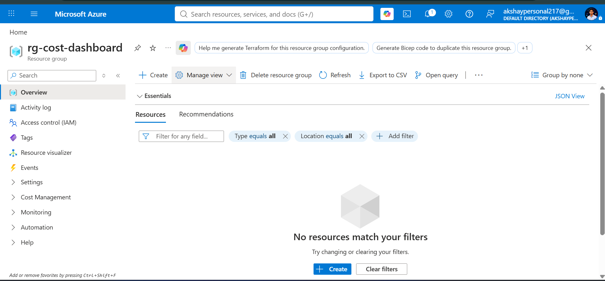
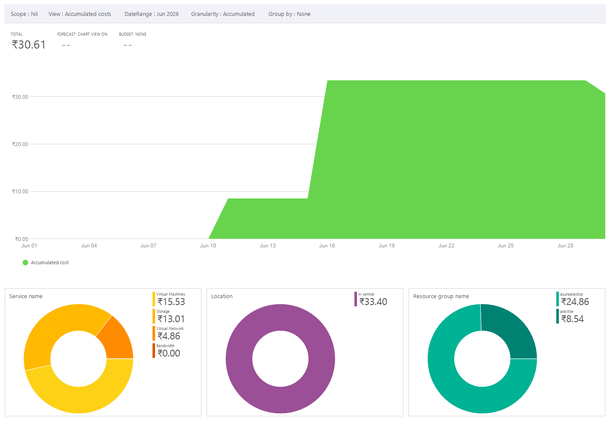
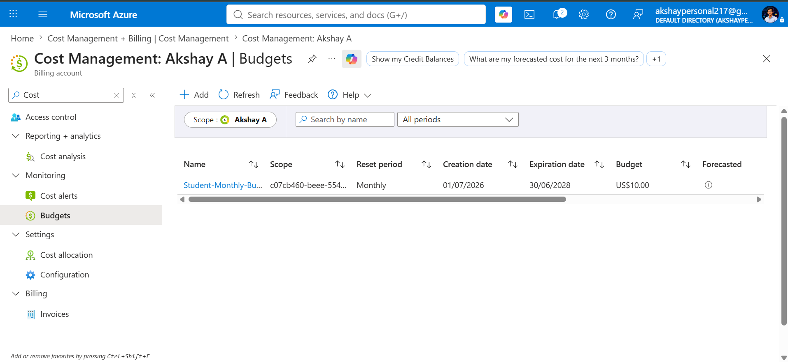

# 💰 Azure Cost Visibility Dashboard


## 📖 Overview

The Azure Cost Visibility Dashboard is a cloud cost monitoring solution built using Microsoft Azure services. It enables organizations to monitor Azure spending, configure monthly budgets, receive automated notifications, and improve cloud cost governance.

This project demonstrates practical implementation of Azure Cost Management, Azure Budgets, Azure Monitor, Action Groups, and Azure Logic Apps.

---

## 🎯 Business Problem

Organizations often struggle to monitor cloud spending effectively. Unexpected Azure costs can result in budget overruns and poor financial governance.

This solution helps administrators:

- Track Azure spending
- Configure monthly budgets
- Receive automatic email alerts
- Improve cloud financial management (FinOps)

---

## 🚀 Features

- Azure Cost Analysis
- Monthly Budget Monitoring
- Budget Threshold Alerts
- Azure Monitor Integration
- Azure Logic App Workflow
- Email Notifications
- Cloud Cost Governance
- FinOps Fundamentals

---

## ☁ Azure Services Used

| Service | Purpose |
|----------|---------|
| Azure Cost Management | Monitor cloud spending |
| Azure Budgets | Configure monthly budgets |
| Azure Monitor | Monitor budget thresholds |
| Action Groups | Trigger notifications |
| Azure Logic Apps | Workflow automation |
| Office 365 Outlook | Send Email Alerts |

---

## 🏗 Architecture


---

## 🔄 Workflow

Azure Resources

↓

Azure Cost Management

↓

Azure Budget

↓

Azure Monitor

↓

Action Group

↓

Logic App

↓

Email Notification

---

## 📁 Project Structure

```text
Azure-Cost-Visibility-Dashboard
│
├── architecture/
│   ├── architecture.png
│   └── architecture.drawio
│
├── docs/
│   ├── deployment-guide.md
│   ├── user-guide.md
│   ├── troubleshooting.md
│   ├── interview-questions.md
│   └── cost-estimation.md
│
├── screenshots/
│   ├── 01-resource-group.png
│   ├── 02-cost-analysis.png
│   ├── 03-budget-created.png
│   ├── 04-logic-app-designer.png
│   ├── 05-action-group.png
│   ├── 06-outlook-workflow.png
│   └── 07-budget-summary.png
│
├── README.md
├── CHANGELOG.md
├── CONTRIBUTING.md
├── SECURITY.md
├── LICENSE
└── .gitignore
```

---

## 📷 Screenshots

### Resource Group



### Cost Analysis



### Budget Created



---

## 💲 Cost Estimation

| Service | Estimated Cost |
|----------|----------------|
| Azure Cost Management | Free |
| Azure Budgets | Free |
| Azure Monitor | Free |
| Action Group | Free |
| Logic App | Free Tier |

Total Estimated Cost: **$0 (Azure for Students)**

---

## ⚠ Challenges Faced

- Understanding Azure Cost Management
- Configuring Azure Budgets
- Working with Logic Apps
- Action Group configuration
- Budget evaluation delay
- Azure Student Subscription limitations

---

## 📚 Key Learnings

- Azure Cost Management
- Azure Budgets
- Azure Monitor
- Azure Logic Apps
- Cloud Governance
- FinOps
- Cost Optimization

---

## 🚀 Future Enhancements

- Power BI Dashboard
- Microsoft Teams Notifications
- Slack Integration
- AI Cost Prediction
- Weekly Cost Reports
- PDF Report Generation
- Multi-subscription Monitoring

---

## 💼 Resume Description

Designed and implemented an Azure Cost Visibility Dashboard using Azure Cost Management, Azure Budgets, Azure Monitor, Action Groups, and Azure Logic Apps to automate cloud cost monitoring and budget notifications.

---

## 👨‍💻 Author

**Akshay A**

B.Tech Artificial Intelligence and Data Science

Cloud & AI Enthusiast

GitHub:
https://github.com/Akshay-tech23

LinkedIn:
https://linkedin.com/in/akshay-a-dev
